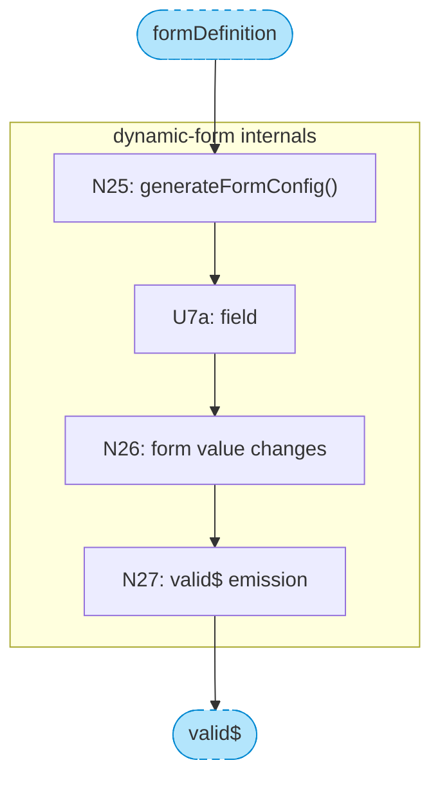
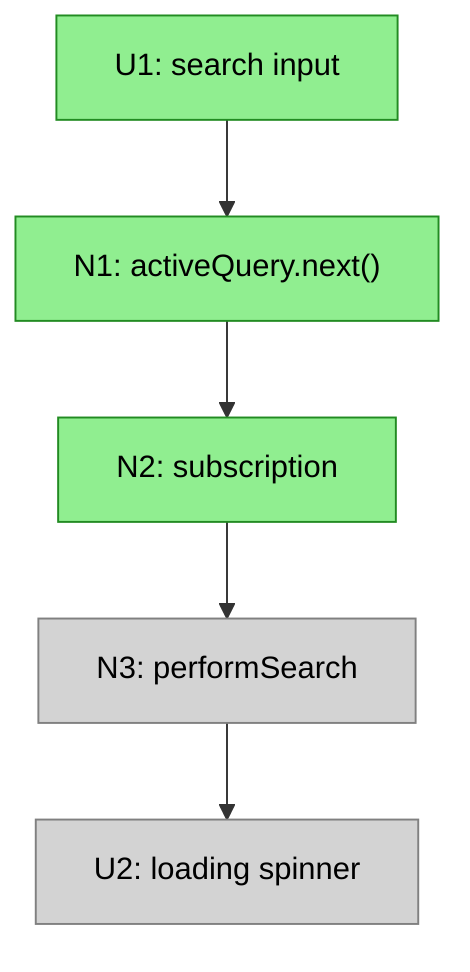

# Chunking and Slicing Breadboards

## Chunking

Chunking collapses a subsystem into a single node in the main diagram, with details shown separately. Use chunking to manage complexity when a section of the breadboard has:

- **One wire in** (single entry point)
- **One wire out** (single output)
- **Lots of internals** between them

### When to Chunk

Look for sections where tracing the wiring reveals a "pinch point" — many affordances that funnel through a single input and single output. These are natural boundaries for chunking.

Example: A `dynamic-form` component receives a form definition, renders many fields (U7a-U7k), validates on change (N26), and emits a single `valid$` signal. In the main diagram, this becomes:

```
N24 -->|formDefinition| dynamicForm
dynamicForm -.->|valid$| U8
```

### How to Chunk

1. **In the main diagram**, replace the subsystem with a single stadium-shaped node:

```
dynamicForm[["CHUNK: dynamic-form"]]
```

2. **Wire to/from the chunk** using the boundary signals:

```
N24 -->|formDefinition| dynamicForm
dynamicForm -.->|valid$| U8
```

3. **Create a separate chunk diagram** showing the internals with boundary markers:



4. **Style chunks distinctly** in the main diagram:

```
classDef chunk fill:#b3e5fc,stroke:#0288d1,color:#000,stroke-width:2px
class dynamicForm chunk
```

### Chunk Color Convention

| Type | Color | Hex |
|------|-------|-----|
| Chunk node (main diagram) | Light blue | `#b3e5fc` |
| Boundary markers (chunk diagram) | Light blue, dashed | `#b3e5fc` with `stroke-dasharray:5 5` |

### Benefits

- **Main diagram stays readable** — complex subsystems become single nodes
- **Detail preserved** — chunk diagrams show the internals when needed
- **Natural boundaries** — chunks often map to reusable components

---

## Slicing a Breadboard

Slicing takes a breadboard and groups its affordances into **vertical implementation slices**. See **Example B** below for a complete slicing example.

**Input:**
- Breadboard (affordance tables with wiring)
- Shape (R + mechanisms) — guides what demos matter

**Output:**
- Breadboard with affordances assigned to slices V1–V9 (max 9 slices)

### What is a Vertical Slice?

A vertical slice is a group of UI and Code affordances that does something demo-able. It cuts through all layers (UI, logic, data) to deliver a working increment.

The opposite is a horizontal slice — doing work on one layer (e.g., "set up all the data models") that isn't clickable from the interface.

### The Key Constraint

**Every slice must have visible UI that can be demoed.** A slice without UI is a horizontal layer, not a vertical slice.

- ✅ "Self-serve Signing Path" (demo: checkout → sign → see signature)
- ❌ "Database Schema" (no demo possible)

**Demo-able means:**
- Has an entry point (UI interaction or trigger)
- Has an observable output (UI renders, effect occurs)
- Shows meaningful progress toward the R

The shape guides what counts as "meaningful progress" — you're not just grouping affordances arbitrarily, you're grouping them to demonstrate mechanisms working.

### Slice Size

- **Too small:** Only 1-2 UI affordances, no meaningful demo → merge with related slice
- **Too big:** 15+ affordances or multiple unrelated journeys → split
- **Right size:** A coherent journey with a clear "watch me do this" demo

Aim for ≤9 slices. If you need more, the shape may be too large for one cycle.

### Wires to Future Slices

A slice may contain affordances with Wires Out pointing to affordances in later slices. These wires exist in the breadboard but aren't implemented yet — they're stubs or no-ops until that later slice is built.

This is normal. The breadboard shows the complete system; slicing shows the order of implementation.

### Procedure

**Step 1: Identify the minimal demo-able increment**

Look at your breadboard and shape. Ask: "What's the smallest subset that demonstrates the core mechanism working?"

Usually this is:
- The core data fetch
- Basic rendering
- No search, no pagination, no state persistence yet

This becomes V1.

**Step 2: Layer additional capabilities as slices**

Look at the mechanisms in your shape. Each slice should demonstrate a mechanism working:
- V2: Search input (demonstrates the search mechanism)
- V3: Pagination/infinite scroll (demonstrates the pagination mechanism)
- V4: URL state persistence (demonstrates the state preservation mechanism)
- etc.

**Max 9 slices.** If you have more, combine related mechanisms. Features that don't make sense alone should be in the same slice.

**Step 3: Assign affordances to slices**

Go through every affordance and assign it to the slice where it's first needed to demo that slice's mechanism:

| Slice | Mechanism | Affordances |
|-------|-----------|-------------|
| V1 | Core display | U2, U3, N3, N4, N5, N6, N7 |
| V2 | Search | U1, N1, N2 |
| V3 | Pagination | U10, N11, N12, N13 |

Some affordances may have Wires Out to later slices — that's fine. They're implemented in their assigned slice; the wires just don't do anything yet.

**Step 4: Create per-slice affordance tables**

For each slice, extract just the affordances being added:

**V2: Search Works**

| # | Component | Affordance | Control | Wires Out | Returns To |
|---|-----------|------------|---------|-----------|------------|
| U1 | search-detail | search input | type | → N1 | — |
| N1 | search-detail | `activeQuery.next()` | call | → N2 | — |
| N2 | search-detail | `activeQuery` subscription | observe | → N3 | — |

**Step 5: Write a demo statement for each slice**

Each slice needs a concrete demo that shows its mechanism working toward the R:
- V1: "Widget shows real data from the API"
- V2: "Type 'dharma', results filter live"
- V3: "Scroll down, more items load"

The demo should be something you can show a stakeholder that demonstrates progress.

### Visualizing Slices in Mermaid

Show the complete breadboard in every slice diagram, but use styling to distinguish scope:

| Category | Style | Description |
|----------|-------|-------------|
| **This slice** | Bright color | Affordances being added |
| **Already built** | Solid grey | Previous slices |
| **Future** | Transparent, dashed border | Not yet built |



This lets stakeholders see:
- What's being built now (highlighted)
- What already exists (grey)
- What's coming later (faded)

### Slice Summary Format

| # | Slice | Mechanism | Demo |
|---|-------|-----------|------|
| V1 | Widget with real data | F1, F4, F6 | "Widget shows letters from API" |
| V2 | Search works | F3 | "Type to filter results" |
| V3 | Infinite scroll | F5 | "Scroll down, more load" |
| V4 | URL state | F2 | "Refresh preserves search" |

The Mechanism column references parts from the shape, showing which mechanisms each slice demonstrates.

---
---

# Examples
