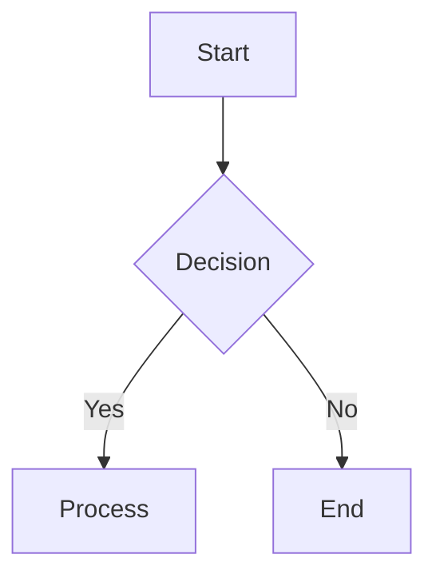
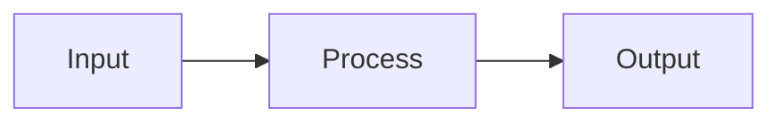
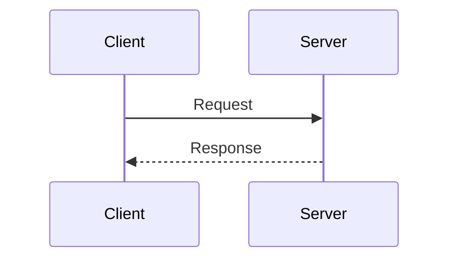
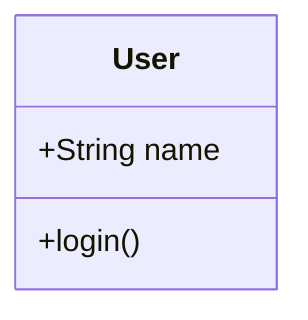
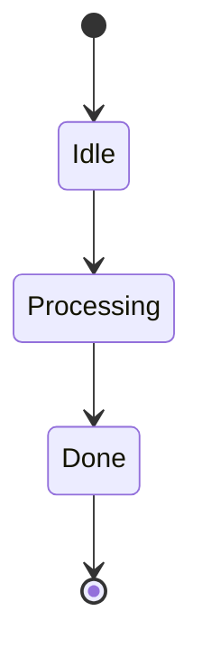
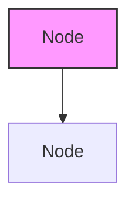
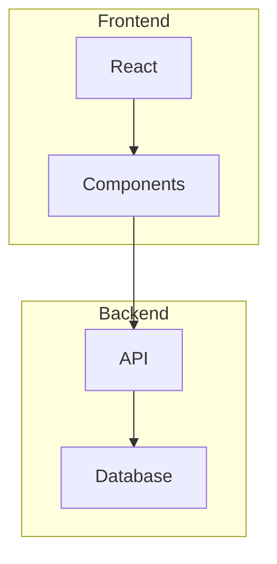

# Mermaid Graph Generation

## Basic Syntax

Use triple backticks with 'mermaid' language specifier:

## Principles

- Prefer clear, concise diagrams that explain the core concept
- Use different node shapes and colors to distinguish different types of elements
- Ensure readability by using meaningful node labels
- Use subgraphs or clusters to show hierarchical or grouped relationships

## Node Shapes

| Syntax | Shape |
|--------|-------|
| `[text]` | Rectangle |
| `(text)` | Rounded rectangle |
| `{text}` | Diamond (decision) |
| `([text])` | Stadium |
| `[[text]]` | Subroutine |
| `[(text)]` | Cylinder (database) |
| `((text))` | Circle |

## Supported Diagram Types

### Flowchart

### Sequence Diagram

### Class Diagram

### State Diagram

## Styling

## Subgraphs

